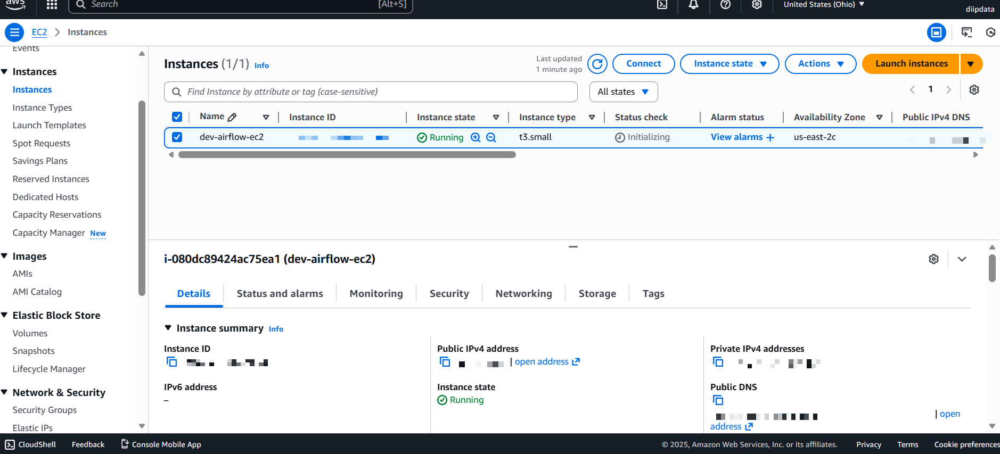
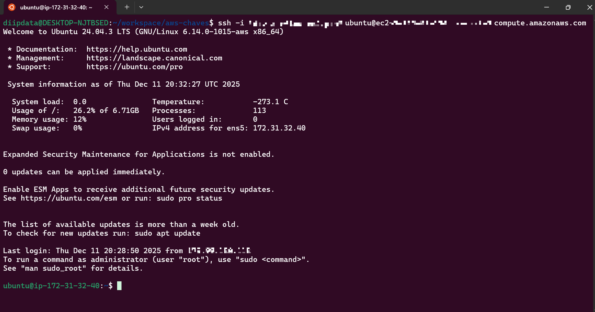
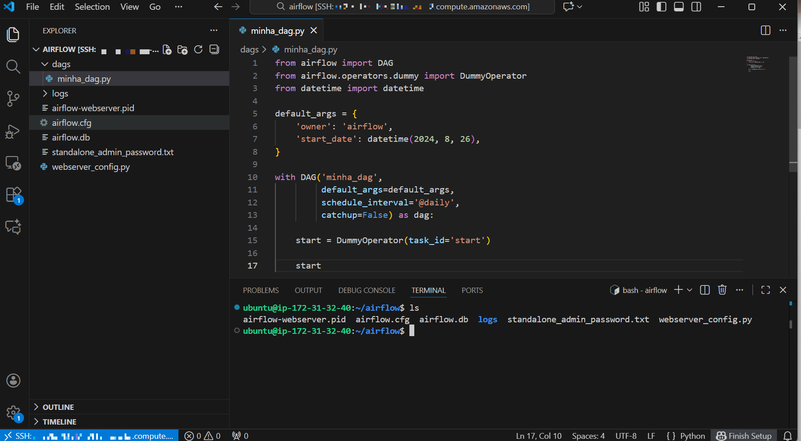
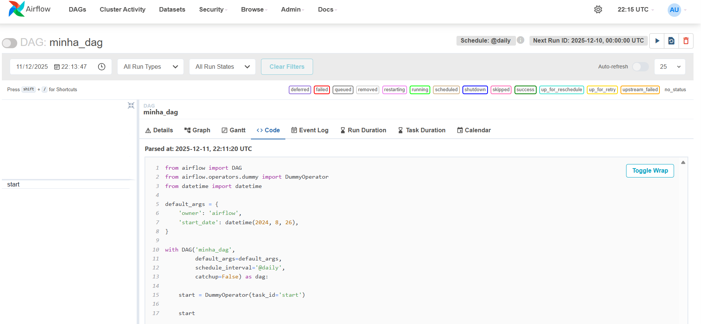

# 🚀 Provisionamento e Configuração de Airflow em EC2 Linux com Baixo Custo


## 📋 Sobre o Projeto

Este projeto consiste na criação de um **ambiente de desenvolvimento robusto na nuvem (AWS)** para orquestração de pipelines de dados. O objetivo principal foi viabilizar o uso do **Apache Airflow** em uma instância EC2 de baixo custo, superando limitações de hardware através de otimizações no sistema operacional.

### Arquitetura e Tecnologias
* **Cloud Compute:** AWS EC2 (Tier T3/T2).
* **OS:** Linux Ubuntu 24.04 LTS.
* **Orquestração:** Apache Airflow 2.10 (Standalone Mode).
* **Conectividade:** SSH Remoto (VSCode Integration).
* **Otimização:** Gerenciamento de Swap Memory e Virtual Environments (venv).


## Desafio Técnico: Superar o "Out of Memory"

**O Problema:** A execução simultânea do *Webserver* e do *Scheduler* do Airflow exige uma quantidade de RAM que excede os limites das instâncias Free Tier (t2.micro/t3.micro), resultando em travamentos constantes (OOM Kills).

**A Solução de Engenharia:**
Implementação de **Swap Memory** (Memória Virtual) no Linux. Alocamos 2GB de disco para atuar como extensão da RAM, suportando os picos de processamento durante a inicialização dos serviços.

```bash
sudo fallocate -l 2G /swapfile
sudo chmod 600 /swapfile
sudo mkswap /swapfile
sudo swapon /swapfile
```

**Resultado:** Um ambiente estável, funcional e economicamente viável para estudos e POCs.

>⚠️ Vale ressaltar que esta abordagem foca na otimização de recursos para estudos utilizando o Free Tier da AWS. Em ambientes de produção com instâncias de maior capacidade (ex: t3.medium+), o uso de Swap é opcional, mas o pipeline de instalação e configuração do Airflow descrito abaixo permanece idêntico.

## Guia de Implementação (Passo a Passo)

### 1. Provisionamento da Infraestrutura
Criação da instância EC2 e configuração do Security Group (liberação da porta 8080 e 22).

- Launch da instância ec2
<p align="center">  </p>

---

### 2. Acesso ssh remoto pelo bash

<p align="center">
  
</p>

---

### 3. Preparação do Sistema Operacional

#### Atualizar lista de pacotes

```bash
sudo apt update && sudo apt upgrade -y
```

#### Instalar gerenciador de pacotes Python e SQLite

```bash
sudo apt install -y python3-pip sqlite3
```

#### Instalar dependências para Postgres (caso decida escalar futuramente)

```bash
sudo apt-get install -y libpq-dev
```
#### Instalar suporte a ambientes virtuais (Python 3.12 - Default Ubuntu 24.04)

```bash
sudo apt install -y python3.12-venv
```

---

### 4. Configuração de Swap 
- Etapa crucial para evitar travamentos em instâncias pequenas

```bash
sudo fallocate -l 2G /swapfile
sudo chmod 600 /swapfile
sudo mkswap /swapfile
sudo swapon /swapfile
```

- **sudo fallocate -l 2G /swapfile**

    - **O que faz**: Cria um arquivo vazio chamado swapfile na raiz do sistema.

- **sudo chmod 600 /swapfile**

  - **O que faz**: Altera as permissões de segurança desse arquivo.

- **sudo mkswap /swapfile**

  - **O que faz:** "Formata" o arquivo.

- **sudo swapon /swapfile**

  - **O que faz:** Ativa a memória.

>⚠️ Swap é uma solução paliativa, funciona para estudos, mas não é recomendado para ambientes de produção devido à perda de performance e desgaste do disco.

---

### 5. Configuração do Ambiente Python
- Isolamos as dependências do projeto para evitar conflitos com o sistema operacional

```bash
python3 -m venv .venv
source .venv/bin/activate
```

---

### 6. **Instalar o Apache Airflow**

- Instalação via pip utilizando as constraints oficiais para garantir estabilidade das versões

#### Define a versão do Airflow e do Python para buscar as constraints corretas automaticamente

```bash
AIRFLOW_VERSION=2.10.0
PYTHON_VERSION="$(python --version | cut -d " " -f 2 | cut -d "." -f 1-2)"
CONSTRAINT_URL="https://raw.githubusercontent.com/apache/airflow/constraints-${AIRFLOW_VERSION}/constraints-${PYTHON_VERSION}.txt"

```

#### Instalação 
- também instalamos o Celery, que é uma biblioteca usada para rodar tarefas em paralelo (distribuídas) e pode ser usada caso precisemos de escala e migração.

```bash
pip install "apache-airflow[celery]==${AIRFLOW_VERSION}" --constraint "${CONSTRAINT_URL}"
```

---


### 7. **Inicializar o Banco de Dados do Airflow**

- Migra o banco de dados do Airflow para garantir que todas as tabelas necessárias sejam criadas

```bash
airflow db migrate
```

### 8. **Criar um Usuário Administrador**

Criar um usuário administrador para acessar a interface web do Airflow

```bash
airflow users create \
    --username admin \
    --firstname Peter \
    --lastname Parker \
    --role Admin \
    --email spiderman@superhero.org
```

- digite uma senha quando solicitado.

--- 
### 9. Execução do Serviço
- Para ambientes de desenvolvimento, utilizamos o modo standalone que sobe todos os componentes (Webserver, Scheduler, Triggerer) de uma vez.

```bash
airflow standalone
```

>⚠️ Nota: O modo standalone utiliza SQLite e SequentialExecutor. Ele não permite paralelismo real de tarefas, sendo ideal apenas para desenvolvimento e estudos.

---

### 10. **Adicionar uma Nova DAG**


#### Desenvolvimento Remoto (VSCode)
- Configuração do Remote SSH no VSCode para editar DAGs diretamente no servidor.

<p align="center">  </p>


Para adicionar uma nova DAG:

1. **Criar o Arquivo da DAG:**

   Navegue até o diretório de DAGs do Airflow e crie um novo arquivo Python para a DAG:

   ```bash
   cd ~/airflow/dags
   ```

   **Exemplo de Conteúdo da DAG:**

   ```python
   from airflow import DAG
   from airflow.operators.dummy import DummyOperator
   from datetime import datetime

   default_args = {
       'owner': 'airflow',
       'start_date': datetime(2024, 8, 26),
   }

   with DAG('minha_dag',
            default_args=default_args,
            schedule_interval='@daily',
            catchup=False) as dag:

       start = DummyOperator(task_id='start')

       start
   ```


## Acessando o Ambiente
### Interface Web
- Com a porta 8080 liberada no Security Group da AWS, acesse pelo DNS público: http://<ec2-public-dns>:8080

<p align="center">  </p>


# Próximos Passos (Roadmap)
Para evoluir este projeto de um ambiente de estudos para um ambiente mais próximo de produção, os seguintes passos foram mapeados:

[ ] Automatização (Systemd): Configurar o Airflow para iniciar automaticamente caso a instância seja reiniciada (criar serviços .service no Linux).

[ ] Banco de Dados Robusto: Substituir o backend SQLite pelo PostgreSQL (instalado localmente ou via Amazon RDS).

[ ] Paralelismo: Alterar o executor para LocalExecutor (permite rodar tarefas em paralelo).

[ ] Deploy de DAGs: Criar um fluxo de CI/CD (GitHub Actions) para enviar as DAGs do repositório para a pasta /dags na EC2 automaticamente.

[ ] Containerização: Migrar essa instalação "bare metal" para Docker/Docker Compose.

---

**Criado por [Diego](https://github.com/diipdata)**  
diegop.freitas@gmail.com | [LinkedIn](https://linkedin.com/in/diegop-freitas) | [X/Twitter](https://x.com/diipdata)

*Feito com ☕ e muitas linhas de código (e alguns erros pelo caminho).*